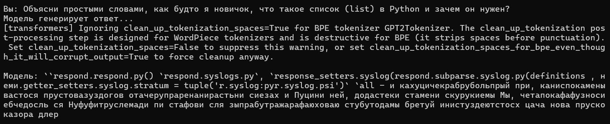

<h1> Дообучение стиля общения LLM-модели (Fine-tuning с LoRA)</h1>

Учебный кейс для портфолио, демонстрирующий адаптацию тональности (Tone of Voice) открытой языковой модели под конкретные задачи с использованием технологии LoRA (Low-Rank Adaptation).

<h2>💼 О проекте и бизнес-ценность</h2>

Дообучение (fine-tuning) позволяет «вшить» правила и стиль общения напрямую в веса модели. Это решает ключевые бизнес-задачи:

<ul>
  <li><strong>Экономия ресурсов:</strong> Устраняет необходимость передавать длинные системные промпты и примеры при каждом запросе, экономя токены и время.</li>
  <li><strong>Стабильность бренда:</strong> Гарантирует единый корпоративный стиль (дружелюбный, официальный, с юмором) во всех автоматизированных ответах.</li>
  <li><strong>Локальность и безопасность:</strong> Весь процесс (от обучения до генерации) выполняется на локальном оборудовании без передачи данных во внешние API.</li>
</ul>

<h2>🛠 Технологический стек</h2>

<ul>
  <li><strong>Язык:</strong> Python</li>
  <li><strong>Фреймворки:</strong> PyTorch, Hugging Face (<code>transformers</code>, <code>peft</code>, <code>accelerate</code>, <code>datasets</code>)</li>
  <li><strong>Метод оптимизации:</strong> LoRA (дообучение только адаптеров без изменения базовых весов)</li>
</ul>

<h2>📂 Структура проекта</h2>

<pre class="tree"><code>.
── fine_tuning/
│   └── train.py          # Скрипт дообучения модели с LoRA
├── inference/
│   └── chat.py           # Скрипт интерактивного чата с дообученной моделью
├── example_dataset.json  # Учебный датасет (87 пар вопрос-ответ)
├── requirements.txt      # Зависимости проекта
└── README.md             # Документация проекта</code></pre>

<h2>🚀 Быстрый старт</h2>

<h3>1. Установка</h3>

Рекомендуется использовать виртуальное окружение (venv):

<pre><code class="language-bash">python -m pip install --upgrade pip
python -m pip install -r requirements.txt</code></pre>

Для авторизации в Hugging Face:

<pre><code class="language-bash">hf auth login</code></pre>

<h3>2. Дообучение (Fine-tuning)</h3>

Запуск обучения на процессоре (CPU). Процесс занимает ~15-30 минут в зависимости от железа:

<pre><code class="language-bash">python fine_tuning/train.py --model_name "sberbank-ai/rugpt3small" --dataset_path "example_dataset.json" --output_dir "fine_tuning/lora_model_cpu" --num_train_epochs 3 --per_device_train_batch_size 1 --gradient_accumulation_steps 1 --device cpu</code></pre>

Для запуска на GPU добавьте флаг <code>--use_4bit</code> и <code>--device cuda</code>.

<h3>3. Запуск чата (Инференс)</h3>

Проверка работы модели после обучения:

<pre><code class="language-bash">python inference/chat.py --base_model "sberbank-ai/rugpt3small" --lora_model "fine_tuning/lora_model_cpu"</code></pre>

<h2>📊 Результаты работы</h2>

<h2>⚠️ Важное примечание к результату</h2>

<blockquote>

В данном учебном кейсе используется ультра-легкая демонстрационная модель (~50 МБ), не имеющая глубокого предобучения на русском языке. Поэтому генерируемый текст может содержать фактические неточности или артефакты.

<strong>Главная цель проекта</strong> — успешная демонстрация корректной работы пайплайна fine-tuning, снижения функции потерь (Loss) и изменения паттернов генерации. В реальных production-задачах для достижения высокого качества используются модели большего размера (от 500 МБ) в комбинации с RAG-системами.

</blockquote>

<h2>📚 Что такое Fine-tuning?</h2>

Fine-tuning — это процесс дообучения уже предобученной нейросети на специализированном наборе данных для адаптации под узкие задачи:

<ul>
  <li>Улучшения стиля общения</li>
  <li>Соблюдения корпоративного tone of voice</li>
  <li>Понимания специфической терминологии</li>
</ul>

<strong>Важно:</strong> Fine-tuning не исправляет ошибки в фактах — для этого используются RAG-системы. Основная цель — корректное соблюдение тональности, правил и стиля при генерации.

<h2> Рекомендации по датасету</h2>

Рекомендованные объёмы для fine-tuning:

<ul>
  <li><strong>100–300 пар</strong> — минимальный объём для первичной проверки результата</li>
  <li><strong>500–1000 пар</strong> — оптимальный объём для стабильного и качественного поведения модели</li>
  <li><strong>2000+ пар</strong> — профессиональный уровень</li>
</ul>

В текущем примере используется 87 пар — этого достаточно для демонстрационного кейса с небольшой моделью.

  <strong>Автор:</strong> TimOfey68 
  <strong>Курс:</strong> Промпт-инжиниринг 3.0 — Карьера на фрилансе 
  <strong>Кейс:</strong> PEcf10 — Портфолио: дообучение стиля общения

</body>
</html>
